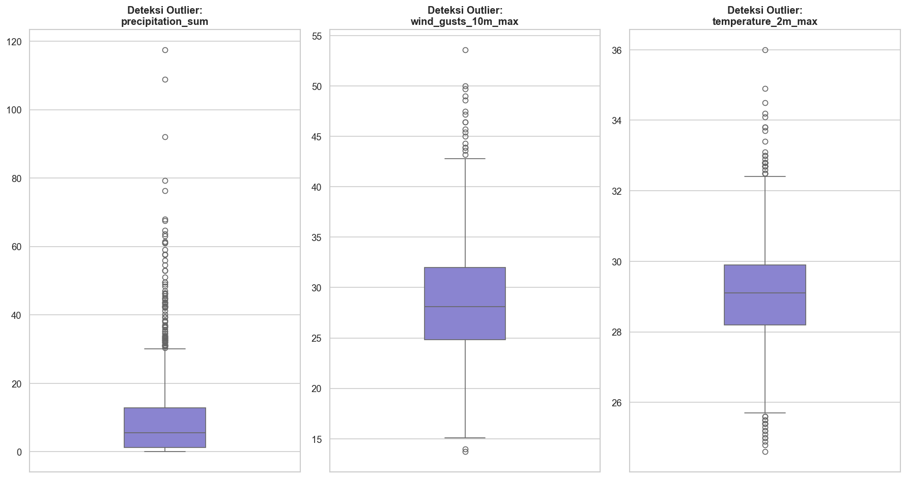
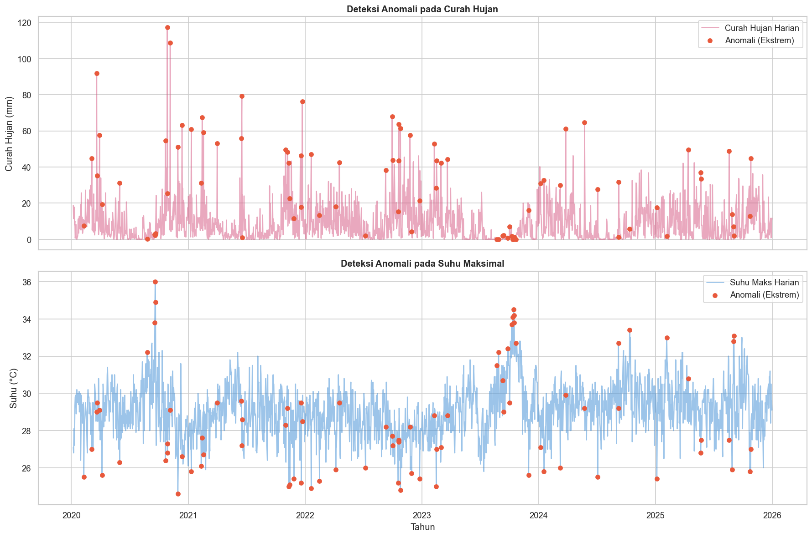
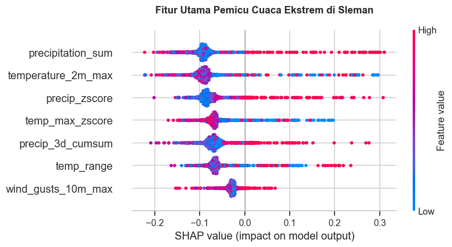
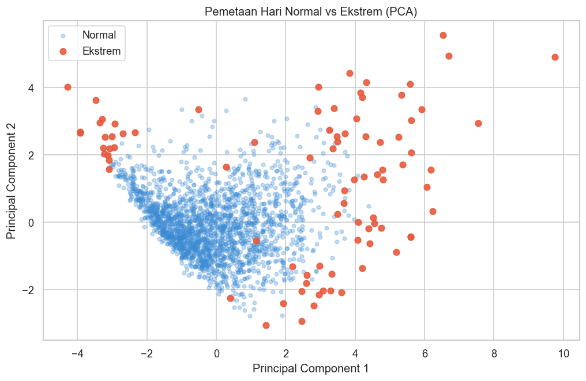

# Prediksi Anomali Cuaca Sleman 🌦️

**Kelompok 5:**
* Ayasha Rahmadinni (24/545462/PA/23178)
* Kevin Antonio Wiyono Lauw (24/535917/PA/22736)
* Kenji Ratanaputra (24/534421/PA/22664)
* Melinda Annastasia Budijono (24/542840/PA/23052)

Repositori ini memuat implementasi *pipeline Machine Learning* untuk melakukan **Deteksi Anomali Cuaca Ekstrem (Unsupervised Anomaly Detection)** pada data cuaca harian di wilayah Sleman, DI Yogyakarta (Periode 2020–2025). 

Proyek ini dibangun menggunakan pendekatan *unsupervised learning* untuk memisahkan kondisi hari normal dengan hari ekstrem (seperti badai hujan, angin kencang, atau gelombang panas ekstrem) dan dilengkapi dengan *Surrogate Model* untuk memvisualisasikan faktor pemicu anomali tersebut menggunakan nilai SHAP.

---

## 🎯 Tujuan Proyek
* **Deteksi Cuaca Ekstrem**: Menggunakan algoritma **Isolation Forest** untuk menemukan 2% hari dengan cuaca paling tidak normal (anomali) di Sleman selama kurun waktu 5 tahun.
* **Analisis Multivariat**: Mengisolasi fenomena cuaca berdasarkan suhu (*Heatwave*) dan curah hujan/angin (*Rainstorm*).
* **Interpretasi (Explainable AI)**: Menggunakan **Random Forest Classifier** sebagai *surrogate model* bersama **SHAP (SHapley Additive exPlanations)** untuk melihat fitur meteorologis mana yang paling berkontribusi terhadap anomali.

---

## 🛠️ Metodologi & Arsitektur Pipeline
1. **Data Preprocessing**: Penanganan missing value dan reduksi outlier dasar.
2. **Feature Engineering**: 
    * `temp_range`: Fluktuasi suhu dalam sehari (Max - Min).
    * `temp_max_zscore`: Z-Score suhu maksimum menggunakan rolling window 30 hari.
    * `precip_3d_cumsum`: Akumulasi hujan 3 hari untuk memetakan potensi banjir.
    * `precip_zscore`: Z-Score curah hujan menggunakan rolling window 30 hari.
    * Pemetaan kalender menjadi *cyclical features* (`month_sin`, `month_cos`).
3. **Penskalaan Data (*Scaling*)**: Menggunakan `RobustScaler` untuk memastikan outlier (anomali) tetap dipertahankan dan tidak rusak akibat *mean-centering*.
4. **Deteksi Anomali**: `IsolationForest` pada fitur Suhu dan fitur Hujan secara terpisah.
5. **Evaluasi Surrogate Model**: Melatih `RandomForestClassifier` untuk memprediksi label anomali dan mengevaluasinya dengan `OOB Score`, `Cross Validation`, `Confusion Matrix`, serta `Classification Report`.
6. **Interpretasi**: Reduksi dimensi dengan PCA dan analisis atribusi fitur menggunakan SHAP.

---

## 📂 Struktur Direktori

```text
prediksi-anomali-cuaca-sleman/
│
├── main.ipynb                  # Jupyter Notebook utama (Pipeline End-to-End)
├── sleman-weather-2020-2025.csv # Dataset historis cuaca Sleman (2020-2025)
├── README.md                   # Dokumentasi proyek (File ini)
└── .gitignore                  # Git ignore rules
```

---

## 💻 Instalasi & Persyaratan

Pastikan Anda menggunakan Python versi 3.8 ke atas. Untuk menjalankan notebook ini, Anda perlu menginstal pustaka berikut:

```bash
# Perbarui pip ke versi terbaru
python -m pip install --upgrade pip

# Instal dependensi pustaka
pip install pandas numpy matplotlib seaborn scikit-learn shap plotly pymannkendall calmap
```

---

## 🚀 Cara Menjalankan
1. *Clone* repositori ini ke komputer lokal Anda.
2. Buka terminal di direktori proyek dan jalankan `jupyter notebook` atau buka proyek menggunakan VSCode (dengan ekstensi Jupyter).
3. Buka file `main.ipynb`.
4. Jalankan *cell* secara berurutan (*Run All*). Notebook telah disusun sedemikian rupa agar tereksekusi linier tanpa kendala (*Dependency Injection* sudah dipastikan aman).

---

## 📊 Klasifikasi Kejadian
Proyek ini mengklasifikasikan kejadian ekstrem ke dalam tipe berikut:
* **Hujan Badai / Angin Kencang**: Detektor hujan menyala.
* **Gelombang Panas / Anomali Suhu**: Detektor suhu menyala.
* **Kombinasi Ekstrem (Hujan Badai & Suhu)**: Kedua detektor menyala pada hari yang sama.
* **Normal**: Tidak ada anomali terdeteksi.

---

## 📈 Visualisasi Hasil
Berikut adalah beberapa hasil plot analisis dari sistem pendeteksi anomali kami:

### 1. Deteksi Anomali dengan Isolation Forest


### 2. Analisis Fitur Pemicu (SHAP)


### 3. Pemetaan Principal Component Analysis (PCA)


### 4. Tren Frekuensi Cuaca Ekstrem (2020-2025)


---
*Dikembangkan untuk analisis iklim komputasional & pengambilan keputusan berbasis data historis wilayah Sleman.*
